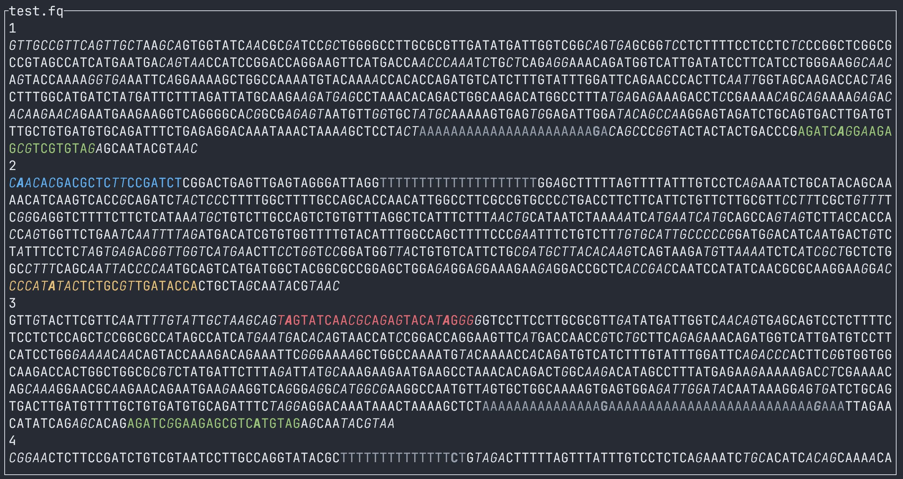
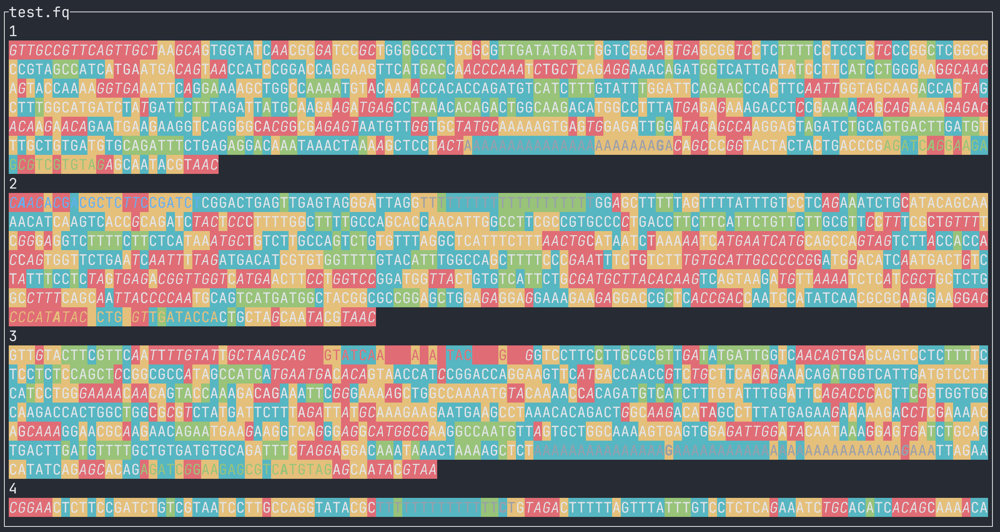

SeqSizzle is a pager for viewing FASTQ and FASTA files with fuzzy matching, allowing different adaptors to be colored differently.  

# Installation

### Pre-built binary

[](https://github.com/ChangqingW/SeqSizzle/actions/workflows/rust.yml)  
You can simply download and run the binary from [Github Actions](https://github.com/ChangqingW/SeqSizzle/releases/latest).

### Conda

SeqSizzle is also available on [bioconda](https://bioconda.github.io/recipes/seqsizzle/README.html):
```
conda install -c bioconda -c conda-forge seqsizzle
```

### Cargo (crates.io)

[](https://crates.io/crates/seqsizzle)
[](https://crates.io/crates/seqsizzle)  
If you already have [a Rust environment set up](https://rustup.rs), you can use the `cargo install` command:
```
cargo install seqsizzle
```
Cargo will build the `seqsizzle` binary and place it in `$HOME/.local/share/cargo/bin/seqsizzle`.

### Cargo (git)

If you already have a Rust environment set up, you can use the `cargo install` command in your local clone of the repo:
```
git clone https://github.com/ChangqingW/SeqSizzle
cd SeqSizzle
cargo install --path .
```
Cargo will build the `seqsizzle` binary and place it in `$HOME/.cargo`.

# Usage
`./seqsizzle -h`:
```
A pager for viewing FASTQ and FASTA files with fuzzy matching, allowing different adaptors to be colored differently.

Usage: seqsizzle [OPTIONS] <FILE> [COMMAND]

Commands:
  summarize  Summarize the reads with patterns specified by the --patterns argument or the adapter flags. Make sure you supply the flags BEFORE the subcommand, e.g. `./SeqSizzle my.fastq -p my_patterns.csv --adapter-3p summarize`. '..' indicats unmatched regions of positive length, '-' indicates the patterns are overlapped, print the number of reads that match each pattern combination in TSV format. To be moved to the UI in the future
  help       Print this message or the help of the given subcommand(s)

Arguments:
  <FILE>  The FASTQ or FASTA file to view (supports .fastq, .fasta, .fa, .fq and their .gz variants)

Options:
      --adapter-3p
          Start with 10x 3' kit adaptors:
           - Patrial Read1: CTACACGACGCTCTTCCGATCT (and reverse complement)
           - Partial TSO: AGATCGGAAGAGCGTCGTGTAG (and reverse complement)
           - Poly(>10)A/T
      --adapter-5p
          Start with 10x 5' kit adaptors
           - Patrial Read1: CTACACGACGCTCTTCCGATCT (and reverse complement)
           - TSO: TTTCTTATATGGG (and reverse complement)
           - Patrial Read2: AGATCGGAAGAGCACACGTCTGAA (and reverse complement)
           - Poly(>10)A/T
  -p, --patterns <PATTERNS_PATH>
          Start with patterns from a CSV file
          Must have the following header:
          pattern,color,editdistance,comment
  -s, --save-patterns <SAVE_PATTERNS_PATH>
          Save the search panel to a CSV file before quitting. To be removed in the future since you can now hit Ctrl-S in the search panel to save the patterns
      --quality-italic
          Enable italic styling for low quality bases (enabled by default)
      --no-quality-italic
          Disable italic styling for low quality bases
      --quality-threshold <QUALITY_THRESHOLD>
          Quality threshold for styling [default: 10]
      --quality-colors
          Enable background color styling based on quality scores. You will probably have a hard time distinguishing forground colors from background colors, so this is disabled by default
  -h, --help
          Print help
  -V, --version
          Print version
```
## Navigation
### Viewer mode

Up / down arrow (or `j` / `k`) to scroll by one line, `Ctrl+U` / `Ctrl+D` to scoll half a screen.  
`/` (or `Ctrl+F`) to toggle search panel, `q` to quit.  
`i` to toggle **I**talics for low quality bases (threshold define by `--quality-threshold`, default 10).  
`b` to toggle **B**ackground color styling based on quality scores  
Viewer mode with background color styling enabled would make forground colors hard to distinguish:

Make sure your terminal supports 256 colors (e.g. terminal emulators like iterm2, kitty, etc.) and your font support italics and bold styles otherwise it may look less appealing.

### search panel mode

Left / right arrow (or Tab / Shift-Tab) to cycle through different input fields and the patterns list.  
When on the patterns list field, up / down arrows cycle through patterns, `Backspace` (or `Delete`, `d`) to delete the selected pattern and `Return` to pop the pattern into the input fields for editing.  
`Return` to add current inputs into the search pattern list (when focusing on any of the input boxes, rather than the patterns list).  
Use **Shift +** arrow keys to move cursor within an input field (as arrow keys alone are bind to cycling input fields).  
`/` or `Esc` to close the search panel.

# Roadmap
## functionality 
 -  [x] Gzip (`fastq.gz`) support
 -  [x] FASTA support
 -  [x] Styling mismatches and low quality bases
 -  [ ] Built-in k-mer enrichment to identify primers and adaptors
 -  [ ] Filter reads by match  
 -  [ ] Counting reads with match  
## UI
 -  [ ] Make elements in the search panel clickable, try implementations discussed in [ratatui repo](https://github.com/ratatui-org/ratatui/discussions/552)  
