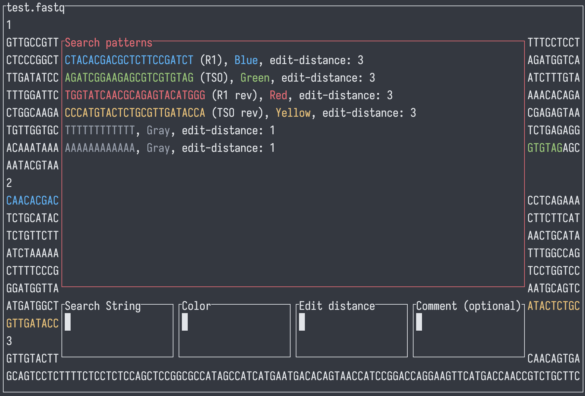

SeqSizzle is a pager for viewing FASTQ files with fuzzy matching, allowing different adaptors to be colored differently.  
[Downloat latest nightly builds for mac / Linux / Windows](https://nightly.link/ChangqingW/SeqSizzle/workflows/rust/master/Binary.zip)  

# Usage
`./SeqSizzle path_to_fastq_file.fastq`  
## Navigation
### Viewer mode

Up / down arrow (or `j` / `k`) to scroll by one line, `Ctrl+U` / `Ctrl+D` to scoll half a screen.  
`/` to toggle search panel, `q` to quit

### search panel mode

Left / right arrow to cycle between different input fields, or `ALT+num` to jump to a specific field.  
When on the patterns list field, up / down arrows cycle through patterns, `D` to delete the selected pattern and return to pop the pattern into the input fields for editing.  
`ALT+5` to add current inputs into the search pattern list.  
Use **Shift +** arrow keys to move cursor within an input field (as arrow keys alone are bind to cycling input fields).  

# Roadmap
## functionality 
 * With exact match, discard surrounding fuzzy match.  
 * Gzip (`fastq.gz`) support  
  - FASTA / regular text file support?  
 * Filter reads by match  
 * Counting reads with match  
## UI
 * Arguments to start with default common primers (10x, Nanopore etc.)  
 * Make elements in the search panel clickable, try implementations discussed in [ratatui repo](https://github.com/ratatui-org/ratatui/discussions/552)  
## Misc
 * Unit tests  
 * Handle illegal seek panic for not seekable files (e.g. shell substitution)
